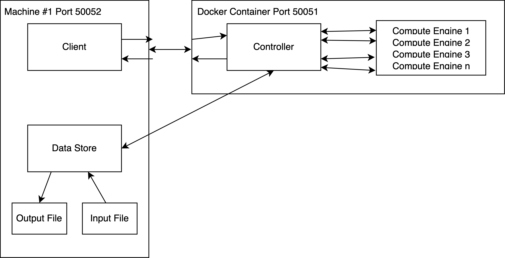

# Software_Engineering_2024

This is software engineering. We love coding!

### Computation: Riemann Summmation
We intend to compute the integral f(x) = an artbitray function, over an arbitrary domanin, with n rectrangles, where n is a positive integer provided by the user.

### Performance Diagnostics
Prior to any performance optimization, we observed the following execution time when calculating 70,000,000 inputs ranging from 1 to 99 averaged over 5 iterations. Each input is done 700,000 times. Cumulative number of calculations is 3,465,000,000 per iteration, so total is 17,325,000,000 individual CPU calculations.  
I noticed that a cache would likely drastically improve the performance, epecially when computing the same values multiple times for multiple runs. To do this, I used an in memory concurrent hash map that the compute engine checks on dispatch, and inserts into after computation if a value was not found.  
The cache, as shown below significantly decreases the amount of time it takes for the entire system to run on the same amount of inputs.    
**Daniel's Computer - Pre-Optimization:** ~20256 ms.  
**Daniel's Computer - Post-Cache-Optimization:** ~8513 ms - 57.97% improvement.  
**Nick's Computer - Pre-Optimization:** ~24564 ms.  
**Nick's Computer - Post-Cache-Optimization:**  ~19140 ms - 22.08% improvement.  
**Nico's Computer - Pre-Optimization:** ~66421.0 milliseconds.
**Nico's Computer - Post-Optimization:** ~57551.0 milliseconds. - 13.35% improvement.

Following cache optimization, I implemented some memory and thread optimizations that decreased the number of threads and heap usage, but likely sacrafices some quantity of time.  

To run the full configuration with the Docker Container, do the following:  
- Modify the HostConfig.java ip address field to contain your local machine's ip address.  
- Run ./gradlew eclipse.  
- Run ./gradlew jibDockerBuild
- Run the main method in DataStoreServer.java to start the local data store server.   
- Run the docker containter with the following command (ensure that the Docker Daemon is enabled) docker run -p 50051:50051 riemannserver:latest  
- Install gRpcurl, and run the following command grpcurl -plaintext -d "{\"inputFile\": \"src/client/test.txt\", \"outputFile\": \"src/client/test_output.txt\", \"delimiter\": \"\n\"}" 0.0.0.0:50051 dataPass.riemannSumService/createRiemannSum  
- Modifications can be made to input and output file paths, as well as the delimiter, but the rest should remain the same.  