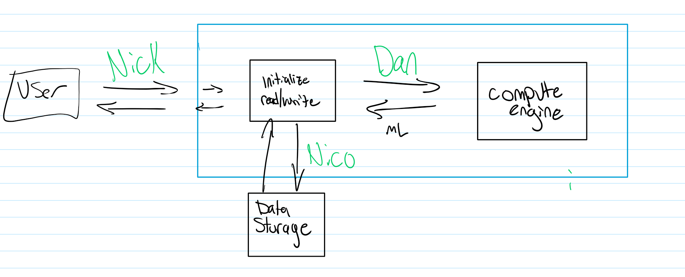

# Software_Engineering_2024

This is software engineering. We love coding!

### Computation: Riemann Summmation
We intend to compute the integral f(x) = an artbitray function, over an arbitrary domanin, with n rectrangles, where n is a positive integer provided by the user.

### Performance Diagnostics
Prior to any performance optimization, we observed the following execution time when calculating 2,000,000 solutions, 1,000,000 unique data inputs averaged over 10 iterations:  
**Daniel's Computer:** 460 milliseconds +- 10 milliseconds.
**Nico's Computer:** 5156 milliseconds +- 10 milliseconds.
