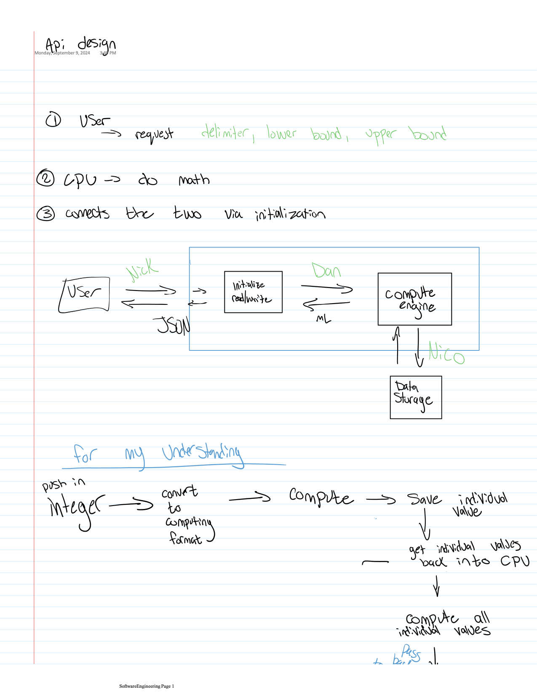
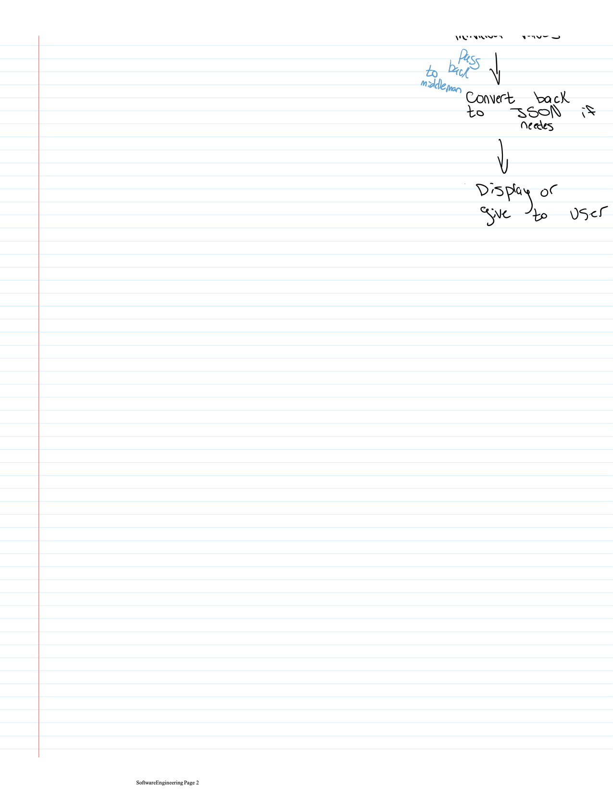

# Software_Engineering_2024

This is software engineering. We love coding!

### Computation: Riemann Summmation
We intend to compute the integral f(x) = an artbitray function, over an arbitrary domanin, with n rectrangles, where n is a positive integer provided by the user.

